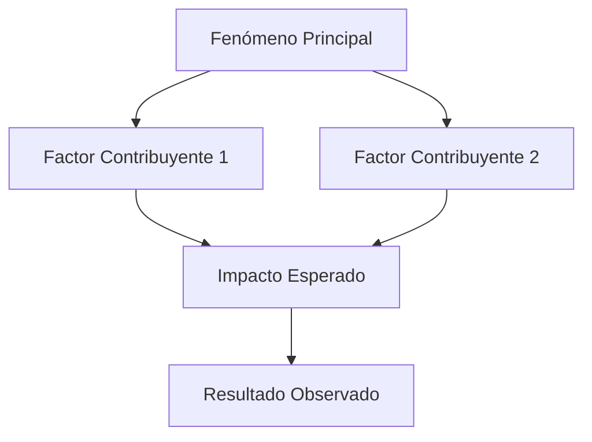

# 🔍 Metodología de Rastreo Profundo con IA
## Módulo 3 - Rastreo Profundo

### 🎯 **Objetivo**
Proporcionar una metodología sistemática para investigación profunda utilizando técnicas avanzadas de IA, validación de fuentes y síntesis de conocimiento.

---

## 📋 **FASE 1: DEFINICIÓN DE LA INVESTIGACIÓN**

### **1.1 Carta de Investigación**
```yaml
investigacion:
  titulo: "[Título de la Investigación]"
  pregunta_central: "[Pregunta de investigación específica]"
  objetivos:
    - "[Objetivo 1 - Específico y medible]"
    - "[Objetivo 2 - Específico y medible]"
    - "[Objetivo 3 - Específico y medible]"
  
  alcance:
    temporal: "[Período de tiempo cubierto]"
    geografico: "[Área geográfica]"
    tematico: "[Temas específicos incluidos]"
    exclusiones: "[Qué NO se incluirá]"
  
  hipotesis:
    principal: "[Hipótesis principal]"
    alternativas: "[Hipótesis alternativas]"
  
  metodologia_ia:
    tecnicas:
      - "Razonamiento Multimodal"
      - "Grounding Real-Time"
      - "Deep Research Patterns"
      - "Fact-Checking Automático"
    herramientas:
      - "ChatGPT-4 para análisis"
      - "NotebookLM para síntesis"
      - "APIs de búsqueda académica"
      - "Herramientas de validación"
```

### **1.2 Plan de Búsqueda Estratégica**
```markdown
# PLAN DE BÚSQUEDA ESTRATÉGICA

## FUENTES PRIMARIAS
### Académicas:
- **Google Scholar:** [Términos de búsqueda específicos]
- **arXiv:** [Áreas específicas de investigación]
- **PubMed:** [Términos médicos/científicos]
- **IEEE Xplore:** [Términos técnicos]

### Institucionales:
- **Gobiernos:** [Sitios .gov relevantes]
- **Organizaciones internacionales:** [UN, WHO, World Bank]
- **Think tanks:** [Brookings, RAND, etc.]

### Datos:
- **Datasets públicos:** [Kaggle, data.gov, etc.]
- **APIs oficiales:** [APIs gubernamentales/empresariales]
- **Bases de datos especializadas:** [Dominio específico]

## FUENTES SECUNDARIAS
### Medios:
- **Prensa especializada:** [Medios del dominio]
- **Revistas profesionales:** [Publicaciones del sector]
- **Blogs expertos:** [Blogs de referencia]

### Social:
- **Expertos en Twitter/LinkedIn:** [Lista de expertos]
- **Foros especializados:** [Comunidades relevantes]
- **Redes académicas:** [ResearchGate, Academia.edu]

## CRITERIOS DE INCLUSIÓN
1. **Relevancia:** Directamente relacionado con pregunta de investigación
2. **Credibilidad:** Fuente verificada y respetada
3. **Actualidad:** Publicado en los últimos [X] años
4. **Metodología:** Estudio bien diseñado y documentado
5. **Impacto:** Citas/referencias significativas

## CRITERIOS DE EXCLUSIÓN
1. **Sesgo evidente:** Contenido claramente parcial
2. **Metodología débil:** Estudios mal diseñados
3. **Fuente no verificable:** Información anónima o dudosa
4. **Contenido promocional:** Marketing disfrazado de investigación
5. **Información desactualizada:** Reemplazada por hallazgos más recientes
```

---

## 🔄 **FASE 2: RECOLECCIÓN Y VALIDACIÓN**

### **2.1 Template de Evaluación de Fuentes**
```markdown
# EVALUACIÓN DE FUENTE - [NOMBRE DE LA FUENTE]

## METADATOS BÁSICOS
- **URL:** [Enlace completo]
- **Título:** [Título del documento/artículo]
- **Autor(es):** [Nombre(s) y afiliación]
- **Fecha de publicación:** [Fecha]
- **Tipo de fuente:** [Artículo académico, reporte, dataset, etc.]

## EVALUACIÓN DE CREDIBILIDAD (1-5)

### 1. Autoridad del Autor:
- **Experiencia en el tema:** [Puntuación] - [Justificación]
- **Afiliación institucional:** [Puntuación] - [Justificación]
- **Historial de publicaciones:** [Puntuación] - [Justificación]

### 2. Calidad de la Fuente:
- **Reputación del medio/publicación:** [Puntuación] - [Justificación]
- **Proceso de revisión:** [Puntuación] - [Justificación]
- **Transparencia metodológica:** [Puntuación] - [Justificación]

### 3. Actualidad y Relevancia:
- **Fecha de publicación:** [Puntuación] - [Justificación]
- **Citas/referencias recientes:** [Puntuación] - [Justificación]
- **Aplicabilidad al contexto actual:** [Puntuación] - [Justificación]

### 4. Objetividad y Sesgo:
- **Transparencia de financiamiento:** [Puntuación] - [Justificación]
- **Balance de perspectivas:** [Puntuación] - [Justificación]
- **Declaración de conflictos de interés:** [Puntuación] - [Justificación]

## PUNTUACIÓN TOTAL: [X]/20
**Umbral de aceptación:** 14/20

## RESUMEN DE HALLAZGOS
- **Puntos fuertes:** [Lista]
- **Debilidades/limitaciones:** [Lista]
- **Recomendación:** [Incluir/Excluir/Incluir con advertencias]

## NOTAS ADICIONALES
[Observaciones, contexto adicional, etc.]
```

### **2.2 Template para Fact-Checking con IA**
```prompt
# PLANTILLA FACT-CHECKING CON IA

## AFIRMACIÓN A VERIFICAR:
"[Inserte la afirmación completa a verificar]"

## CONTEXTO:
- **Origen de la afirmación:** [Dónde se encontró]
- **Fecha de la afirmación:** [Cuándo se hizo]
- **Contexto en que se hizo:** [Circunstancias relevantes]

## INSTRUCCIONES PARA IA:
"Verifica la siguiente afirmación utilizando técnicas de fact-checking avanzado:

1. **Búsqueda de fuentes primarias:** Encuentra la fuente original de la información
2. **Validación cruzada:** Busca al menos 3 fuentes independientes que corroboren o refuten
3. **Análisis de contexto:** Considera el contexto completo, no solo la afirmación aislada
4. **Evaluación de evidencia:** Clasifica la evidencia como fuerte/débil/insuficiente
5. **Identificación de sesgos:** Detecta posibles sesgos en las fuentes o en la afirmación

Usa estas fuentes prioritarias:
- Bases de datos académicas (Google Scholar, PubMed)
- Datos oficiales (gobiernos, organizaciones internacionales)
- Medios de verificación de hechos (Snopes, FactCheck.org)
- Documentación técnica oficial

## FORMATO DE RESPUESTA:

### 1. VERIFICACIÓN DE HECHOS
```
ESTATUS: [VERDADERO/FALSO/EN DISCUSIÓN/NO VERIFICABLE]

EVIDENCIA A FAVOR:
- [Fuente 1]: [Cita/evidencia]
- [Fuente 2]: [Cita/evidencia]
- [Fuente 3]: [Cita/evidencia]

EVIDENCIA EN CONTRA:
- [Fuente 1]: [Cita/evidencia]
- [Fuente 2]: [Cita/evidencia]
- [Fuente 3]: [Cita/evidencia]

EVIDENCIA INSUFICIENTE:
- [Áreas donde falta evidencia]
```

### 2. ANÁLISIS DE CONTEXTO
- **Contexto original:** [Cómo se entendía originalmente]
- **Interpretaciones alternativas:** [Otras formas de interpretar]
- **Limitaciones de la verificación:** [Qué no se pudo verificar y por qué]

### 3. RECOMENDACIONES
- **Confianza en la afirmación:** [Alta/Media/Baja] - [Justificación]
- **Acciones recomendadas:** [Qué hacer con esta información]
- **Fuentes para monitorear:** [Dónde buscar actualizaciones]

### 4. METADATOS DE VERIFICACIÓN
- **Fecha de verificación:** [Fecha]
- **Fuentes consultadas:** [Lista completa]
- **Tiempo de investigación:** [Horas/minutos]
- **Nivel de confianza:** [Porcentaje]
```
```

---

## 🧠 **FASE 3: ANÁLISIS Y SÍNTESIS**

### **3.1 Template de Análisis Multimodal**
```markdown
# ANÁLISIS MULTIMODAL - [TEMA]

## DATOS ANALIZADOS
### Textual:
- [Descripción de documentos/textos analizados]
- [Volumen: X documentos, Y palabras]

### Numérico/Datasets:
- [Descripción de datasets]
- [Tamaño: X filas, Y columnas]

### Visual:
- [Descripción de imágenes/diagramas]
- [Cantidad: X imágenes]

### Auditivo (si aplica):
- [Descripción de contenido auditivo]
- [Duración: X minutos/horas]

## TÉCNICAS DE ANÁLISIS APLICADAS

### 1. Análisis de Texto:
- **NLP avanzado:** [Técnicas específicas usadas]
- **Extracción de entidades:** [Qué entidades se identificaron]
- **Análisis de sentimiento:** [Resultados clave]
- **Topic modeling:** [Temas identificados]

### 2. Análisis de Datos:
- **Estadística descriptiva:** [Métricas calculadas]
- **Análisis de correlación:** [Correlaciones encontradas]
- **Identificación de patrones:** [Patrones significativos]
- **Detección de anomalías:** [Anomalías identificadas]

### 3. Análisis Visual:
- **OCR y extracción de texto:** [Texto extraído de imágenes]
- **Análisis de diagramas:** [Estructuras identificadas]
- **Reconocimiento de objetos:** [Objetos identificados]
- **Análisis de composición:** [Composición visual]

## SÍNTESIS INTEGRADA

### Hallazgos Cruzados:
```
TEXTO → DATOS: [Cómo los hallazgos textuales se relacionan con datos]
DATOS → VISUAL: [Cómo los datos se manifiestan visualmente]
VISUAL → TEXTO: [Cómo lo visual complementa el texto]
```

### Insights Emergentes:
1. **Insight 1:** [Descripción] - [Evidencia multimodal]
2. **Insight 2:** [Descripción] - [Evidencia multimodal]
3. **Insight 3:** [Descripción] - [Evidencia multimodal]

### Patrones Identificados:
- **Patrón A:** [Descripción] - [Manifestación en diferentes modos]
- **Patrón B:** [Descripción] - [Manifestación en diferentes modos]
- **Patrón C:** [Descripción] - [Manifestación en diferentes modos]

## CONCLUSIÓN MULTIMODAL
- **Narrativa unificada:** [Cómo todos los modos cuentan una historia coherente]
- **Vacíos identificados:** [Qué falta en el análisis multimodal]
- **Recomendaciones para investigación futura:** [Qué otros modos explorar]
```

### **3.2 Template para Síntesis de Conocimiento**
```prompt
# PLANTILLA SÍNTESIS DE CONOCIMIENTO

## CONTEXTO DE INVESTIGACIÓN:
[Descripción breve del proyecto de investigación]

## DOCUMENTOS ANALIZADOS:
1. **[Documento 1]:** [Título] - [Tipo] - [Fecha]
2. **[Documento 2]:** [Título] - [Tipo] - [Fecha]
3. **[Documento 3]:** [Título] - [Tipo] - [Fecha]
[Agregar más según sea necesario]

## INSTRUCCIONES PARA IA:
"Sintetiza el conocimiento de los documentos anteriores para crear una comprensión integral del tema.

Sigue este proceso:

### FASE 1: EXTRACCIÓN DE CONCEPTOS CLAVE
Identifica los 10-15 conceptos más importantes que emergen de TODOS los documentos combinados.

### FASE 2: MAPEO DE RELACIONES
Muestra cómo se relacionan estos conceptos entre sí. Crea un mapa mental de las conexiones.

### FASE 3: IDENTIFICACIÓN DE CONSENSOS Y DISENSOS
- ¿En qué puntos hay acuerdo entre las fuentes?
- ¿Dónde hay desacuerdo o perspectivas contradictorias?
- ¿Qué áreas están bien establecidas vs. qué áreas son controvertidas?

### FASE 4: DETECCIÓN DE VACÍOS
- ¿Qué preguntas importantes NO están respondidas?
- ¿Qué perspectivas o metodologías faltan?
- ¿Qué áreas necesitan más investigación?

### FASE 5: SÍNTESIS INTEGRADA
Crea una narrativa coherente que integre todos los hallazgos en una comprensión unificada.

## FORMATO DE RESPUESTA:

### 1. CONCEPTOS CLAVE Y RELACIONES
```
CONCEPTO PRINCIPAL 1:
- Definición: [Definición sintetizada]
- Relaciones: [Cómo se relaciona con otros conceptos]
- Evidencia: [Qué documentos apoyan este concepto]
- Importancia: [Por qué es crucial]

CONCEPTO PRINCIPAL 2:
[Estructura similar...]
```

### 2. MAPA CONCEPTUAL
```
[Diagrama textual o descripción de relaciones]
Concepto A ←→ Concepto B (fuerte relación)
Concepto B → Concepto C (relación causal)
Concepto C ← Concepto D (influencia unidireccional)
```

### 3. CONSENSOS Y DISENSOS
**ÁREAS DE CONSENSO (≥80% acuerdo):**
1. [Consenso 1] - [Grado de acuerdo] - [Implicaciones]
2. [Consenso 2] - [Grado de acuerdo] - [Implicaciones]

**ÁREAS DE DISENSO (perspectivas contradictorias):**
1. [Disenso 1] - [Perspectivas en conflicto] - [Evidencia de cada lado]
2. [Disenso 2] - [Perspectivas en conflicto] - [Evidencia de cada lado]

**ÁREAS EMERGENTES (investigación reciente/inconclusa):**
1. [Área 1] - [Estado actual] - [Direcciones futuras]
2. [Área 2] - [Estado actual] - [Direcciones futuras]

### 4. VACÍOS IDENTIFICADOS
**Vacíos metodológicos:**
- [Vacío 1] - [Impacto] - [Cómo llenarlo]
- [Vacío 2] - [Impacto] - [Cómo llenarlo]

**Vacíos temáticos:**
- [Vacío 1] - [Importancia] - [Oportunidades de investigación]
- [Vacío 2] - [Importancia] - [Oportunidades de investigación]

**Vacíos de perspectiva:**
- [Grupo/perspectiva faltante] - [Por qué es importante] - [Cómo incluirlo]

### 5. SÍNTESIS INTEGRADA
**Narrativa unificada:**
[2-3 párrafos que integren todos los hallazgos en una historia coherente]

**Implicaciones prácticas:**
- Para investigadores: [Recomendaciones]
- Para practicantes: [Aplicaciones]
- Para policymakers: [Consideraciones]

**Direcciones futuras:**
1. [Prioridad 1] - [Justificación]
2. [Prioridad 2] - [Justificación]
3. [Prioridad 3] - [Justificación]
```
```

---

## 📊 **FASE 4: VISUALIZACIÓN Y COMUNICACIÓN**

### **4.1 Template para Dashboard de Investigación**
```html
<!-- dashboard-investigacion.html -->
<!DOCTYPE html>
<html lang="es">
<head>
    <meta charset="UTF-8">
    <meta name="viewport" content="width=device-width, initial-scale=1.0">
    <title>Dashboard de Investigación - [Nombre del Proyecto]</title>
    <style>
        :root {
            --module3-primary: #B2D8E5;    /* Soft Blue - Módulo 3 */
            --module3-secondary: #4DA8C4;  /* Corporate Blue */
            --module3-accent: #66CCCC;     /* Mint */
            --module3-dark: #004B63;       /* Dark Blue */
            --success: #4CAF50;
            --warning: #FF9800;
            --error: #F44336;
        }
        
        .research-dashboard {
            font-family: 'Segoe UI', Tahoma, Geneva, Verdana, sans-serif;
            max-width: 1400px;
            margin: 0 auto;
            padding: 20px;
        }
        
        .dashboard-header {
            background: linear-gradient(135deg, var(--module3-dark), var(--module3-secondary));
            color: white;
            padding: 30px;
            border-radius: 15px;
            margin-bottom: 30px;
        }
        
        .metric-card {
            background: white;
            border-radius: 10px;
            padding: 20px;
            box-shadow: 0 4px 6px rgba(0, 0, 0, 0.1);
            border-top: 4px solid var(--module3-primary);
            margin-bottom: 20px;
        }
        
        .source-timeline {
            display: flex;
            overflow-x: auto;
            gap: 15px;
            padding: 20px 0;
        }
        
        .timeline-item {
            min-width: 200px;
            background: var(--module3-accent);
            color: var(--module3-dark);
            padding: 15px;
            border-radius: 8px;
            text-align: center;
        }
        
        .confidence-meter {
            height: 20px;
            background: #e0e0e0;
            border-radius: 10px;
            overflow: hidden;
            margin: 10px 0;
        }
        
        .confidence-fill {
            height: 100%;
            background: linear-gradient(90deg, var(--error), var(--warning), var(--success));
        }
    </style>
</head>
<body>
    <div class="research-dashboard">
        <!-- Header -->
        <div class="dashboard-header">
            <h1>🔍 Dashboard de Investigación</h1>
            <p>Proyecto: [Nombre del Proyecto] | Última actualización: [Fecha]</p>
        </div>
        
        <!-- Métricas clave -->
        <div class="grid-3">
            <div class="metric-card">
                <h3>📚 Fuentes Analizadas</h3>
                <div class="metric-value">47</div>
                <div class="metric-trend">+12 esta semana</div>
            </div>
            
            <div class="metric-card">
                <h3>🎯 Tasa de Verificación</h3>
                <div class="metric-value">92%</div>
                <div class="confidence-meter">
                    <div class="confidence-fill" style="width: 92%"></div>
                </div>
            </div>
            
            <div class="metric-card">
                <h3>⏱️ Tiempo de Investigación</h3>
                <div class="metric-value">84h</div>
                <div class="metric-sub">Promedio: 1.8h/fuente</div>
            </div>
        </div>
        
        <!-- Línea de tiempo de fuentes -->
        <div class="metric-card">
            <h3>📅 Línea de Tiempo de Fuentes</h3>
            <div class="source-timeline">
                <div class="timeline-item">
                    <div class="date">2023</div>
                    <div class="count">8 fuentes</div>
                    <div class="confidence">Alta</div>
                </div>
                <div class="timeline-item">
                    <div class="date">2022</div>
                    <div class="count">15 fuentes</div>
                    <div class="confidence">Media-Alta</div>
                </div>
                <div class="timeline-item">
                    <div class="date">2021</div>
                    <div class="count">12 fuentes</div>
                    <div class="confidence">Media</div>
                </div>
                <div class="timeline-item">
                    <div class="date">2020</div>
                    <div class="count">7 fuentes</div>
                    <div class="confidence">Media-Baja</div>
                </div>
                <div class="timeline-item">
                    <div class="date">2019-</div>
                    <div class="count">5 fuentes</div>
                    <div class="confidence">Baja</div>
                </div>
            </div>
        </div>
        
        <!-- Hallazgos clave -->
        <div class="metric-card">
            <h3>💡 Hallazgos Clave</h3>
            <div class="findings-grid">
                <div class="finding" style="border-color: var(--success);">
                    <h4>Consenso Principal</h4>
                    <p>[Descripción del hallazgo consensuado]</p>
                    <div class="evidence">Evidencia: 32/47 fuentes</div>
                </div>
                
                <div class="finding" style="border-color: var(--warning);">
                    <h4>Área Controversial</h4>
                    <p>[Descripción del área con desacuerdo]</p>
                    <div class="evidence">Perspectivas: 18 vs 14 fuentes</div>
                </div>
                
                <div class="finding" style="border-color: var(--module3-primary);">
                    <h4>Vacío Identificado</h4>
                    <p>[Descripción del área que necesita investigación]</p>
                    <div class="evidence">Cobertura: Solo 3/47 fuentes</div>
                </div>
            </div>
        </div>
        
        <!-- Métricas de calidad -->
        <div class="metric-card">
            <h3>📊 Métricas de Calidad</h3>
            <table class="quality-table">
                <tr>
                    <th>Métrica</th>
                    <th>Valor Actual</th>
                    <th>Objetivo</th>
                    <th>Tendencia</th>
                </tr>
                <tr>
                    <td>Diversidad de Fuentes</td>
                    <td>78%</td>
                    <td>>85%</td>
                    <td>↗️ Mejorando</td>
                </tr>
                <tr>
                    <td>Actualidad Promedio</td>
                    <td>2.1 años</td>
                    <td>< 2 años</td>
                    <td>➡️ Estable</td>
                </tr>
                <tr>
                    <td>Transparencia Metodológica</td>
                    <td>65%</td>
                    <td>>75%</td>
                    <td>↗️ Mejorando</td>
                </tr>
                <tr>
                    <td>Verificación Cruzada</td>
                    <td>88%</td>
                    <td>>90%</td>
                    <td>↘️ Necesita atención</td>
                </tr>
            </table>
        </div>
    </div>
</body>
</html>
```

### **4.2 Template para Reporte Ejecutivo**
```markdown
# REPORTE EJECUTIVO DE INVESTIGACIÓN
## [Nombre del Proyecto]

### RESUMEN EJECUTIVO
**Para:** [Audiencia]
**De:** [Equipo de investigación]
**Fecha:** [Fecha]
**Páginas:** [Número]

---

## 🎯 **1. OBJETIVOS Y METODOLOGÍA**

### 1.1 Objetivos de la Investigación
- **Primario:** [Objetivo principal]
- **Secundarios:** [Objetivos adicionales]
- **Preguntas de investigación:** [Lista de preguntas]

### 1.2 Metodología Aplicada
- **Enfoque:** [Cualitativo/Cuantitativo/Mixto]
- **Técnicas de IA utilizadas:** [Lista]
- **Fuentes consultadas:** [Número y tipos]
- **Período de investigación:** [Fechas]
- **Limitaciones metodológicas:** [Lista]

---

## 📊 **2. HALLAZGOS PRINCIPALES**

### 2.1 Consensos Establecidos
```yaml
hallazgo_1:
  descripcion: "[Descripción del hallazgo]"
  evidencia: "[Fuentes que lo apoyan]"
  confianza: "[Nivel de confianza]"
  implicaciones: "[Qué significa]"

hallazgo_2:
  descripcion: "[Descripción del hallazgo]"
  evidencia: "[Fuentes que lo apoyan]"
  confianza: "[Nivel de confianza]"
  implicaciones: "[Qué significa]"
```

### 2.2 Áreas de Controversia
```yaml
controversia_1:
  descripcion: "[Qué está en disputa]"
  perspectiva_a: "[Argumentos a favor]"
  perspectiva_b: "[Argumentos en contra]"
  estado_actual: "[Cuál perspectiva tiene más apoyo]"
  recomendacion: "[Cómo proceder]"
```

### 2.3 Tendencias Emergentes
- **Tendencia 1:** [Descripción] - [Momentum] - [Implicaciones]
- **Tendencia 2:** [Descripción] - [Momentum] - [Implicaciones]
- **Tendencia 3:** [Descripción] - [Momentum] - [Implicaciones]

---

## 🔍 **3. ANÁLISIS PROFUNDO**

### 3.1 Patrones Identificados


### 3.2 Relaciones Causales
- **Causa → Efecto:** [Relación identificada] - [Fuerza de evidencia]
- **Factor moderador:** [Qué modifica la relación] - [Impacto]
- **Factor mediador:** [Qué explica la relación] - [Mecanismo]

### 3.3 Vacíos de Conocimiento
1. **Vacío metodológico:** [Qué falta metodológicamente] - [Impacto]
2. **Vacío temático:** [Qué temas no están cubiertos] - [Importancia]
3. **Vacío temporal:** [Qué períodos faltan] - [Relevancia]

---

## 🚀 **4. RECOMENDACIONES ESTRATÉGICAS**

### 4.1 Recomendaciones Inmediatas (1-3 meses)
```yaml
recomendacion_1:
  accion: "[Acción específica]"
  responsable: "[Quién]"
  timeline: "[Cuándo]"
  recursos: "[Qué se necesita]"
  metricas_exito: "[Cómo medir]"

recomendacion_2:
  accion: "[Acción específica]"
  responsable: "[Quién]"
  timeline: "[Cuándo]"
  recursos: "[Qué se necesita]"
  metricas_exito: "[Cómo medir]"
```

### 4.2 Recomendaciones a Medio Plazo (3-12 meses)
- **Iniciativa A:** [Descripción] - [ROI esperado] - [Riesgos]
- **Iniciativa B:** [Descripción] - [ROI esperado] - [Riesgos]
- **Iniciativa C:** [Descripción] - [ROI esperado] - [Riesgos]

### 4.3 Recomendaciones de Investigación Futura
1. **Prioridad alta:** [Tema] - [Justificación] - [Metodología sugerida]
2. **Prioridad media:** [Tema] - [Justificación] - [Metodología sugerida]
3. **Prioridad baja:** [Tema] - [Justificación] - [Metodología sugerida]

---

## 📈 **5. MÉTRICAS Y SEGUIMIENTO**

### 5.1 KPIs Recomendados
| KPI | Línea Base | Objetivo 3M | Objetivo 12M | Fuente de Datos |
|-----|------------|-------------|--------------|-----------------|
| [KPI 1] | [Valor] | [Objetivo] | [Objetivo] | [Fuente] |
| [KPI 2] | [Valor] | [Objetivo] | [Objetivo] | [Fuente] |
| [KPI 3] | [Valor] | [Objetivo] | [Objetivo] | [Fuente] |

### 5.2 Sistema de Monitoreo
- **Frecuencia:** [Con qué frecuencia monitorear]
- **Responsable:** [Quién monitorea]
- **Alertas:** [Qué dispara alertas]
- **Reporting:** [Formato y frecuencia de reportes]

### 5.3 Revisión Periódica
- **Revisión mensual:** [Qué revisar] - [Quiénes] - [Duración]
- **Revisión trimestral:** [Qué revisar] - [Quiénes] - [Duración]
- **Revisión anual:** [Qué revisar] - [Quiénes] - [Duración]

---

## 🎨 **6. APÉNDICES**

### A. Metodología Detallada
[Descripción técnica completa de métodos]

### B. Fuentes Consultadas
[Lista completa con evaluaciones]

### C. Análisis Estadístico
[Resultados estadísticos detallados]

### D. Glosario de Términos
[Definiciones de términos técnicos]

### E. Equipo de Investigación
[Información del equipo y roles]

---

## 📞 **7. INFORMACIÓN DE CONTACTO**

**Investigador Principal:** [Nombre] - [Email] - [Teléfono]
**Equipo de Soporte:** [Información de contacto]
**Sitio Web del Proyecto:** [URL]
**Repositorio de Datos:** [URL]

**Fecha de próxima actualización:** [Fecha]
**Versión del reporte:** [Número de versión]

---

**© 2024 EdutechLife - IALab Módulo 3**  
*Investigación profunda, conclusiones claras*  
🔍 **#DeepResearch #AIAnalysis #EvidenceBased**  
📧 investigacion@edutechlife.com | 🌐 www.edutechlife.com/ialab/module3