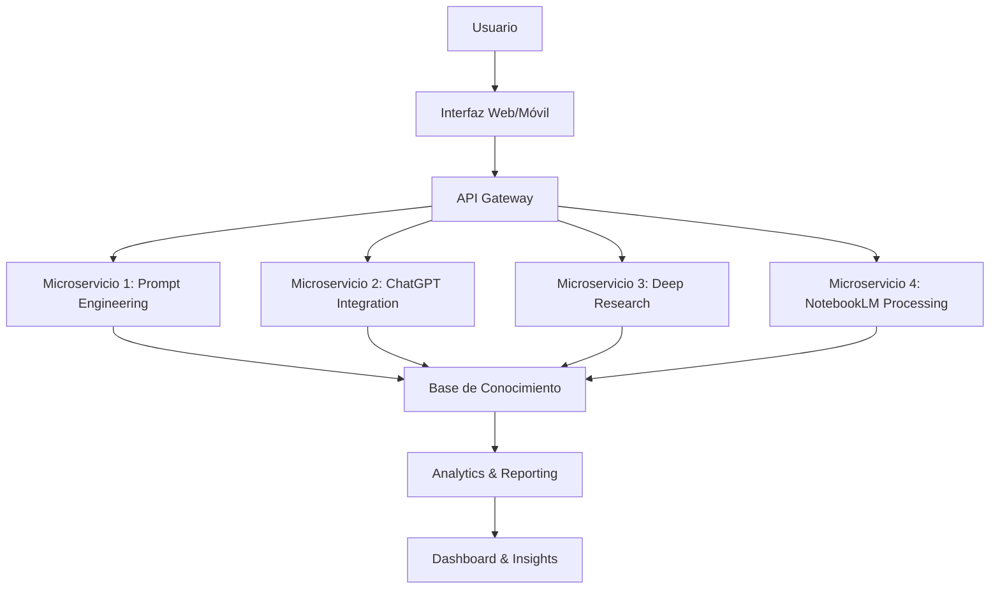
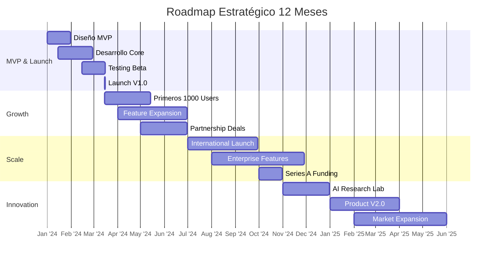

# 🏆 Proyecto Final IALab - Template Completo
## Módulo 5: Proyecto Disruptivo

### 🚀 **Visión del Proyecto**
*"Integrar todas las técnicas aprendidas para crear una solución de IA con impacto real"*

---

## 📋 **FASE 1: DEFINICIÓN DEL PROYECTO**

### **1.1 Carta de Proyecto**
```yaml
proyecto:
  nombre: "[Nombre Innovador y Descriptivo]"
  tagline: "[Frase que capture la esencia en 5-7 palabras]"
  version: "1.0 MVP"
  
vision:
  corto_plazo: "[Objetivo a 3 meses]"
  medio_plazo: "[Objetivo a 1 año]"
  largo_plazo: "[Visión a 3+ años]"
  
equipo:
  lider: "[Nombre] - Rol: [Especialización]"
  miembros: 
    - "[Nombre] - [Rol/Expertise]"
    - "[Nombre] - [Rol/Expertise]"
    - "[Nombre] - [Rol/Expertise]"
  
paleta_corporativa:
  primary: "#FFD166"  # Gold - Módulo 5
  secondary: "#4DA8C4" # Corporate Blue
  accent: "#66CCCC"   # Mint
  background: "#B2D8E5" # Soft Blue
  dark: "#004B63"     # Dark Blue
```

### **1.2 Declaración de Problema**
```markdown
## PROBLEMA IDENTIFICADO
**¿Qué?** [Descripción clara del problema]
**¿Para quién?** [Audiencia afectada]
**¿Por qué importa?** [Impacto cuantificable]

## EVIDENCIA DEL PROBLEMA
- **Dato 1:** [Estadística o métrica]
- **Dato 2:** [Testimonio o caso real]
- **Dato 3:** [Tendencia del mercado]

## CONSECUENCIAS ACTUALES
1. [Consecuencia económica/social/operativa]
2. [Pérdida de eficiencia/oportunidades]
3. [Impacto en calidad de vida/trabajo]
```

### **1.3 Propuesta de Valor Único**
```markdown
# PROPUESTA DE VALOR

## SOLUCIÓN ACTUAL vs NUESTRA SOLUCIÓN

### ❌ **Enfoque Tradicional:**
- [Limitación 1]
- [Limitación 2] 
- [Limitación 3]
- Costo: [X]
- Tiempo: [Y]

### ✅ **Nuestra Solución con IA:**
- [Ventaja 1 - Usando técnica del Módulo 1]
- [Ventaja 2 - Usando técnica del Módulo 2]
- [Ventaja 3 - Usando técnica del Módulo 3]
- [Ventaja 4 - Usando técnica del Módulo 4]
- Costo: [X/10]
- Tiempo: [Y/5]

## VALOR CUANTIFICABLE
- **Eficiencia:** +[X]% de mejora
- **Precisión:** +[Y]% de aumento
- **Costo:** -[Z]% de reducción
- **Tiempo:** -[W]% de disminución
```

---

## 🛠️ **FASE 2: ARQUITECTURA TÉCNICA**

### **2.1 Stack Tecnológico Integrado**


### **2.2 Especificaciones Técnicas**
```json
{
  "technical_stack": {
    "frontend": {
      "framework": "React 18 + Vite",
      "styling": "TailwindCSS + Framer Motion",
      "state_management": "Context API + Zustand",
      "charts": "Recharts"
    },
    "backend": {
      "runtime": "Node.js 20 + Express",
      "ai_integration": "DeepSeek API + OpenAI API",
      "database": "PostgreSQL + Redis Cache",
      "authentication": "JWT + OAuth2"
    },
    "ai_components": {
      "prompt_engineering": {
        "techniques": ["Chain-of-Thought", "Few-Shot", "Role Play"],
        "templates": "Sistema dinámico de templates",
        "optimization": "A/B testing de prompts"
      },
      "chatgpt_integration": {
        "models": ["gpt-4-turbo", "gpt-4o"],
        "features": ["Function Calling", "Streaming", "Fine-tuning"],
        "cost_optimization": "Cache layer + request batching"
      },
      "research_tools": {
        "sources": ["Google Scholar", "arXiv", "PubMed"],
        "validation": "Fact-checking automático",
        "synthesis": "NotebookLM integration"
      }
    }
  }
}
```

### **2.3 Template de Prompt para Arquitectura**
```prompt
# PROMPT PARA ARQUITECTURA DE IA

## CONTEXTO:
Eres un arquitecto de soluciones de IA con 10+ años de experiencia.
Diseña la arquitectura para: [DESCRIPCIÓN BREVE DEL PROYECTO]

## REQUISITOS:
1. **Escalabilidad:** Soporte para 10K usuarios concurrentes
2. **Costo-efectividad:** Optimización de llamadas a API de IA
3. **Modularidad:** Componentes independientes y reemplazables
4. **Seguridad:** Protección de datos y prompts
5. **Monitorización:** Métricas en tiempo real

## COMPONENTES REQUERIDOS:
- [ ] Sistema de gestión de prompts (Módulo 1)
- [ ] Integración ChatGPT avanzada (Módulo 2)
- [ ] Motor de investigación profunda (Módulo 3)
- [ ] Procesador de documentos NotebookLM (Módulo 4)
- [ ] Dashboard analítico unificado

## FORMATO DE SALIDA:
1. Diagrama de arquitectura (mermaid.js)
2. Stack tecnológico recomendado
3. Estimación de costos mensuales
4. Plan de implementación por fases
5. Métricas de éxito clave (KPIs)
```

---

## 📊 **FASE 3: DESARROLLO DEL MVP**

### **3.1 Definición de MVP**
```markdown
# MVP (Minimum Viable Product) - Versión 1.0

## 🎯 **Funcionalidades Core (Must Have)**
### Feature 1: [Nombre] - Prioridad: CRÍTICA
- **Descripción:** [Qué hace]
- **Técnica IA utilizada:** [Módulo/Técnica específica]
- **Criterios de aceptación:**
  - [ ] AC1: [Criterio medible]
  - [ ] AC2: [Criterio medible]
  - [ ] AC3: [Criterio medible]
- **Métrica de éxito:** [KPI específico]

### Feature 2: [Nombre] - Prioridad: ALTA
- **Descripción:** [Qué hace]
- **Técnica IA utilizada:** [Módulo/Técnica específica]
- **Criterios de aceptación:**
  - [ ] AC1: [Criterio medible]
  - [ ] AC2: [Criterio medible]
  - [ ] AC3: [Criterio medible]
- **Métrica de éxito:** [KPI específico]

## 📈 **Funcionalidades Nice-to-Have (V2.0)**
- [ ] Feature A: [Descripción breve]
- [ ] Feature B: [Descripción breve]
- [ ] Feature C: [Descripción breve]

## 🚫 **Funcionalidades Excluidas (Future)**
- [ ] Feature X: [Razón de exclusión]
- [ ] Feature Y: [Razón de exclusión]
- [ ] Feature Z: [Razón de exclusión]
```

### **3.2 Sprint Planning Template**
```markdown
# SPRINT [Número] - [Fechas]

## 🎯 OBJETIVO DEL SPRINT
[Objetivo específico y medible]

## 📋 BACKLOG DEL SPRINT

### User Story 1: [Título]
**Como** [rol de usuario]
**Quiero** [acción deseada]
**Para** [beneficio/valor]

**Criterios de aceptación:**
- [ ] [Criterio 1]
- [ ] [Criterio 2]
- [ ] [Criterio 3]

**Tareas técnicas:**
- [ ] [Tarea 1 - Frontend]
- [ ] [Tarea 2 - Backend]
- [ ] [Tarea 3 - IA Integration]
- [ ] [Tarea 4 - Testing]

**Estimación:** [X] puntos
**Responsable:** [Nombre]

### User Story 2: [Título]
[Estructura similar...]

## 📊 CAPACIDAD DEL EQUIPO
- **Desarrolladores:** [Número] personas × [Horas/día] = [Total horas]
- **Diseñadores:** [Número] personas × [Horas/día] = [Total horas]
- **Especialistas IA:** [Número] personas × [Horas/día] = [Total horas]

## 🎯 DEFINICIÓN DE TERMINADO
- [ ] Código revisado y aprobado
- [ ] Tests unitarios pasando (>90% coverage)
- [ ] Tests de integración IA funcionando
- [ ] Documentación actualizada
- [ ] Demo funcional preparada
```

### **3.3 Template de Código para Integración IA**
```javascript
// integration-ia.js
/**
 * Integración unificada de técnicas IALab
 * @module IALabIntegration
 */

class IALabIntegration {
  constructor(config) {
    this.config = {
      corporateColors: {
        petroleum: '#2D7A94',
        corporateBlue: '#4DA8C4',
        mint: '#66CCCC',
        softBlue: '#B2D8E5',
        gold: '#FFD166'
      },
      ...config
    };
    
    // Inicializar módulos
    this.promptEngine = new PromptEngine();
    this.chatGPTManager = new ChatGPTManager();
    this.researchAssistant = new ResearchAssistant();
    this.notebookLMProcessor = new NotebookLMProcessor();
  }

  /**
   * Ejecutar flujo completo de procesamiento IA
   * @param {Object} input - Datos de entrada
   * @returns {Promise<Object>} Resultados integrados
   */
  async processCompleteFlow(input) {
    try {
      // Fase 1: Ingeniería de Prompts (Módulo 1)
      const masterPrompt = await this.promptEngine.generateMasterPrompt({
        context: input.context,
        objective: input.objective,
        template: 'advanced'
      });

      // Fase 2: Potencia ChatGPT (Módulo 2)
      const chatGPTResponse = await this.chatGPTManager.process({
        prompt: masterPrompt,
        model: 'gpt-4-turbo',
        temperature: 0.7,
        maxTokens: 2000
      });

      // Fase 3: Rastreo Profundo (Módulo 3)
      const researchData = await this.researchAssistant.deepResearch({
        query: chatGPTResponse.analysis,
        sources: ['scholar', 'arxiv', 'reports'],
        depth: 'comprehensive'
      });

      // Fase 4: NotebookLM Integration (Módulo 4)
      const synthesizedKnowledge = await this.notebookLMProcessor.synthesize({
        documents: researchData.documents,
        format: 'executive_summary',
        includeAudio: true
      });

      // Integración final
      return {
        success: true,
        data: {
          masterPrompt,
          chatGPTAnalysis: chatGPTResponse,
          researchFindings: researchData,
          synthesizedOutput: synthesizedKnowledge,
          visualizations: this.generateVisualizations(synthesizedKnowledge),
          recommendations: this.extractRecommendations(synthesizedKnowledge)
        },
        metadata: {
          processingTime: Date.now() - startTime,
          modulesUsed: [1, 2, 3, 4],
          corporateTheme: this.config.corporateColors.gold
        }
      };
    } catch (error) {
      console.error('Error en flujo IA:', error);
      return {
        success: false,
        error: error.message,
        fallback: await this.fallbackProcess(input)
      };
    }
  }

  /**
   * Generar visualizaciones con paleta corporativa
   */
  generateVisualizations(data) {
    return {
      charts: [
        {
          type: 'bar',
          data: data.metrics,
          colors: [
            this.config.corporateColors.gold,
            this.config.corporateColors.corporateBlue,
            this.config.corporateColors.mint
          ]
        }
      ],
      infographics: this.createInfographic(data),
      progressDashboard: this.buildProgressDashboard(data)
    };
  }

  /**
   * Crear infografía corporativa
   */
  createInfographic(data) {
    return `
      <div class="infographic" style="
        border: 3px solid ${this.config.corporateColors.gold};
        background: linear-gradient(135deg, 
          ${this.config.corporateColors.softBlue}20, 
          ${this.config.corporateColors.mint}20
        );
        font-family: 'Montserrat', 'Open Sans', sans-serif;
      ">
        <!-- Contenido de infografía -->
      </div>
    `;
  }
}

module.exports = IALabIntegration;
```

---

## 📈 **FASE 4: PITCH DECK & ROADMAP**

### **4.1 Template de Pitch Deck**
```markdown
# PITCH DECK - [NOMBRE DEL PROYECTO]

## SLIDE 1: PORTADA
**Título:** [Nombre del Proyecto]
**Tagline:** [Frase impactante]
**Logo:** [Incluir logo con paleta corporativa]
**Equipo:** [Nombres y roles clave]

## SLIDE 2: EL PROBLEMA
- **Dato impactante:** [Estadística que duele]
- **Caso real:** [Historia de usuario]
- **Costo actual:** [Pérdida económica/social]
- **"El status quo está roto"**

## SLIDE 3: NUESTRA SOLUCIÓN
- **Una frase:** [Explicación simple]
- **Diagrama simple:** [Cómo funciona]
- **Magia de IA:** [Qué hace diferente]
- **Demo rápida:** [Screenshot o GIF]

## SLIDE 4: TECNOLOGÍA PROPRIETARIA
- **Stack IALab:** Integración de 4 módulos
- **Innovación:** [Qué hacemos que nadie más hace]
- **Patentes/Secretos:** [Protección intelectual]
- **Scalability:** [Arquitectura escalable]

## SLIDE 5: MERCADO & OPORTUNIDAD
- **TAM:** [Total Addressable Market] - $X Billones
- **SAM:** [Serviceable Available Market] - $Y Millones
- **SOM:** [Serviceable Obtainable Market] - $Z Millones
- **Crecimiento:** [Tasa de crecimiento anual]

## SLIDE 6: MODELO DE NEGOCIO
- **Revenue Streams:**
  1. [Fuente 1] - $[X]/mes
  2. [Fuente 2] - $[Y]/mes
  3. [Fuente 3] - $[Z]/mes
- **Pricing:** [Estructura de precios]
- **LTV/CAC:** [Lifetime Value / Customer Acquisition Cost]

## SLIDE 7: TRACCIÓN & LOGROS
- **MVP:** [Lo que hemos construido]
- **Usuarios:** [Números actuales]
- **Testimonios:** [Citas de usuarios]
- **Métricas clave:** [KPIs impresionantes]

## SLIDE 8: EQUIPO
- **Foto equipo:** [Foto profesional]
- **Expertise:** [Años de experiencia combinada]
- **Logros previos:** [Exits, premios, reconocimientos]
- **Por qué nosotros:** [Ventaja competitiva]

## SLIDE 9: ROADMAP
- **Q1 2024:** [MVP & Beta Testing]
- **Q2 2024:** [Launch & First 1000 Users]
- **Q3 2024:** [Feature Expansion]
- **Q4 2024:** [Scale & International]
- **2025:** [Vision a largo plazo]

## SLIDE 10: FINANCIACIÓN
- **Round:** [Seed/Series A]
- **Amount:** $[X] Millones
- **Uso de fondos:**
  - 40%: Engineering & Product
  - 30%: Marketing & Sales
  - 20%: Operations
  - 10%: Contingency
- **Milestones:** [Qué lograremos con esta ronda]

## SLIDE 11: ASK & CONTACTO
- **Inversión buscada:** $[X] por [Y]%
- **Valuación:** $[Z] Millones
- **Contacto:** [Nombre, email, teléfono]
- **"Únete a nuestra misión"**
```

### **4.2 Roadmap Estratégico 12 Meses**


### **4.3 Template de Métricas y KPIs**
```yaml
# DASHBOARD DE MÉTRICAS - PROYECTO IALab

## MÉTRICAS DE PRODUCTO
product_metrics:
  engagement:
    daily_active_users: 
      current: 0
      target_q1: 1000
      target_q2: 5000
      target_q3: 15000
    session_duration:
      current: "0:00"
      target: ">10:00"
    feature_adoption:
      module_1: 0%
      module_2: 0%
      module_3: 0%
      module_4: 0%
  
  quality:
    error_rate: 
      current: 0%
      target: "<2%"
    response_time:
      current: "0ms"
      target: "<2000ms"
    user_satisfaction:
      current: 0
      target: ">4.5/5"

## MÉTRICAS DE NEGOCIO
business_metrics:
  revenue:
    mrr: 
      current: "$0"
      target_q1: "$10,000"
      target_q2: "$50,000"
      target_q3: "$150,000"
    arr_projection:
      current: "$0"
      target: "$1,800,000"
  
  growth:
    cac: 
      current: "$0"
      target: "<$100"
    ltv:
      current: "$0"
      target: ">$600"
    ltv_cac_ratio:
      current: 0
      target: ">3:1"
  
  market:
    market_share:
      current: "0%"
      target_q4: "5%"
    brand_awareness:
      current: 0
      target: ">50,000 mentions"

## MÉTRICAS DE IA
ai_metrics:
  performance:
    accuracy: 
      current: "0%"
      target: ">95%"
    hallucination_rate:
      current: "0%"
      target: "<1%"
    training_data_quality:
      current: "0/100"
      target: ">90/100"
  
  cost:
    cost_per_query:
      current: "$0"
      target: "<$0.01"
    api_optimization:
      current: "0%"
      target: ">40% savings"
    infrastructure_cost:
      current: "$0"
      target: "<$5000/month"
```

---

## 🎯 **FASE 5: PRESENTACIÓN FINAL**

### **5.1 Template de Presentación Final**
```markdown
# PRESENTACIÓN FINAL PROYECTO IALab

## SECCIÓN 1: INTRODUCCIÓN
**Proyecto:** [Nombre]
**Equipo:** [Miembros]
**Mentor:** [Nombre si aplica]
**Fecha:** [Fecha de presentación]

## SECCIÓN 2: PROBLEMA & OPORTUNIDAD
### 2.1 El Problema Identificado
- [Descripción breve]
- [Datos de mercado]
- [Caso de uso real]

### 2.2 Investigación de Mercado
- **TAM/SAM/SOM:** [Cifras]
- **Competencia:** [Análisis SWOT]
- **Tendencias:** [Tendencias de IA relevantes]

## SECCIÓN 3: SOLUCIÓN PROPUESTA
### 3.1 Visión del Producto
- [Qué es]
- [Cómo funciona]
- [Demo en vivo]

### 3.2 Integración de Módulos IALab
- **Módulo 1:** [Cómo aplicamos Ingeniería de Prompts]
- **Módulo 2:** [Cómo aplicamos Potencia ChatGPT]
- **Módulo 3:** [Cómo aplicamos Rastreo Profundo]
- **Módulo 4:** [Cómo aplicamos NotebookLM]
- **Sinergia:** [Cómo se integran todos]

## SECCIÓN 4: IMPLEMENTACIÓN TÉCNICA
### 4.1 Arquitectura
- [Diagrama técnico]
- [Stack tecnológico]
- [Innovaciones técnicas]

### 4.2 Desarrollo del MVP
- [Timeline realizado]
- [Desafíos superados]
- [Lecciones aprendidas]

## SECCIÓN 5: RESULTADOS & MÉTRICAS
### 5.1 Métricas Alcanzadas
- [KPIs del producto]
- [Feedback de usuarios]
- [Pruebas de concepto]

### 5.2 Validación del Mercado
- [Interés de usuarios]
- [Feedback de expertos]
- [Potencial de escalamiento]

## SECCIÓN 6: PLAN DE NEGOCIO
### 6.1 Modelo de Negocio
- [Revenue streams]
- [Estructura de costos]
- [Proyecciones financieras]

### 6.2 Go-to-Market Strategy
- [Plan de marketing]
- [Canales de adquisición]
- [Partnerships estratégicos]

## SECCIÓN 7: ROADMAP FUTURO
### 7.1 Próximos Pasos (3-6 meses)
- [Features planeadas]
- [Expansión de mercado]
- [Necesidades de recursos]

### 7.2 Visión a Largo Plazo
- [Escalabilidad]
- [Impacto potencial]
- [Visión de la compañía]

## SECCIÓN 8: DEMO EN VIVO
**Duración:** 5-7 minutos
**Enfoque:** [Qué aspectos destacar]
**Interacción:** [Cómo involucrar a la audiencia]

## SECCIÓN 9: Q&A PREPARADO
### Preguntas Anticipadas:
1. **Técnica:** "¿Cómo manejan [desafío técnico específico]?"
2. **Mercado:** "¿Qué los diferencia de [competidor]?"
3. **Negocio:** "¿Cuál es su plan de monetización?"
4. **Escalabilidad:** "¿Cómo escalan técnicamente?"
5. **Equipo:** "¿Qué experiencia tienen en [área específica]?"

## SECCIÓN 10: CIERRE & CONTACTO
**Resumen Ejecutivo:** [3 puntos clave]
**Call to Action:** [Qué buscamos ahora]
**Información de Contacto:**
- Email: [email]
- LinkedIn: [perfil]
- Website: [sitio web]
- Demo: [link a demo]

**"Gracias por su tiempo y consideración"**
```

### **5.2 Checklist de Evaluación Final**
```markdown
# CHECKLIST DE EVALUACIÓN - PROYECTO FINAL

## 📋 DEFINICIÓN DEL PROYECTO (20%)
- [ ] Problema claramente definido y validado
- [ ] Solución innovadora con propuesta de valor única
- [ ] Integración de al menos 3 módulos IALab
- [ ] Paleta corporativa aplicada consistentemente

## 🛠️ IMPLEMENTACIÓN TÉCNICA (30%)
- [ ] MVP funcional y desplegado
- [ ] Código bien estructurado y documentado
- [ ] Integración real de APIs de IA
- [ ] Sistema escalable y robusto
- [ ] Pruebas y validación realizadas

## 📊 ANÁLISIS & MÉTRICAS (20%)
- [ ] Métricas de producto definidas y medidas
- [ ] Análisis de mercado completo
- [ ] Proyecciones financieras realistas
- [ ] KPIs de éxito claramente definidos

## 🎯 PRESENTACIÓN & COMUNICACIÓN (20%)
- [ ] Pitch deck profesional y persuasivo
- [ ] Demo en vivo funcional y engaging
- [ ] Comunicación clara y efectiva
- [ ] Respuestas a preguntas preparadas

## 🚀 INNOVACIÓN & POTENCIAL (10%)
- [ ] Elementos innovadores únicos
- [ ] Potencial de impacto real
- [ ] Escalabilidad demostrada
- [ ] Visión a largo plazo clara

## PUNTUACIÓN TOTAL: [ ]/100
```

---

## 🎨 **RECURSOS ADICIONALES**

### **Paleta Corporativa Completa:**
```css
/* EdutechLife Corporate Identity */
:root {
  /* Primary Palette */
  --petroleum: #2D7A94;      /* Authority, Trust */
  --corporate-blue: #4DA8C4; /* Innovation, Technology */
  --mint: #66CCCC;           /* Growth, Freshness */
  --soft-blue: #B2D8E5;      /* Calm, Clarity */
  
  /* Module 5 Specific */
  --gold: #FFD166;           /* Achievement, Excellence */
  --dark-blue: #004B63;      /* Depth, Professionalism */
  
  /* Supporting Colors */
  --success: #4CAF50;
  --warning: #FF9800;
  --error: #F44336;
  --info: #2196F3;
}

/* Typography */
--heading-font: 'Montserrat', sans-serif;
--body-font: 'Open Sans', sans-serif;
--code-font: 'JetBrains Mono', monospace;

/* Gradients */
--gradient-primary: linear-gradient(135deg, var(--petroleum), var(--corporate-blue));
--gradient-success: linear-gradient(135deg, var(--mint), var(--soft-blue));
--gradient-accent: linear-gradient(135deg, var(--gold), var(--warning));
```

### **Plantillas de Archivos:**
```
/proyecto-final-ialab/
├── 01-documentacion/
│   ├── carta-proyecto.md
│   ├── especificaciones-tecnicas.md
│   ├── analisis-mercado.md
│   └── plan-negocio.md
├── 02-codigo/
│   ├── frontend/
│   ├── backend/
│   ├── ia-integration/
│   └── tests/
├── 03-presentacion/
│   ├── pitch-deck.pptx
│   ├── script-presentacion.md
│   ├── demo-screenshots/
│   └── qa-preparado.md
├── 04-metricas/
│   ├── dashboard-data.json
│   ├── user-feedback.csv
│   ├── financial-projections.xlsx
│   └── kpi-tracker.md
└── 05-recursos/
    ├── brand-assets/
    ├── templates-reutilizables/
    ├── third-party-integrations/
    └── legal-documents/
```

### **Checklist de Entrega Final:**
- [ ] **Código fuente** completo y documentado
- [ ] **MVP desplegado** y accesible
- [ ] **Pitch deck** profesional (PPT/PDF)
- [ ] **Demo en vivo** preparada (5-7 min)
- [ ] **Documentación técnica** completa
- [ ] **Análisis de mercado** actualizado
- [ ] **Plan de negocio** detallado
- [ ] **Métricas y KPIs** medidos
- [ ] **Feedback de usuarios** recopilado
- [ ] **Plan de escalamiento** definido
- [ ] **Presupuesto y financiación** calculados
- [ ] **Roadmap futuro** detallado
- [ ] **Contact information** incluida
- [ ] **Todos los archivos** en formato digital
- [ ] **Backup completo** en la nube

---

## 🏆 **CRITERIOS DE ÉXITO**

### **Nivel Básico (Aprobado):**
- ✅ MVP funcional con integración básica de IA
- ✅ Documentación completa del proyecto
- ✅ Presentación clara y profesional
- ✅ Aplicación de al menos 2 módulos IALab

### **Nivel Avanzado (Excelente):**
- ✅ Integración completa de 4 módulos IALab
- ✅ Sistema escalable y bien arquitecturado
- ✅ Métricas de negocio validadas
- ✅ Demo impresionante y engaging
- ✅ Plan de escalamiento realista

### **Nivel Élite (Destacado):**
- ✅ Innovación técnica significativa
- ✅ Validación de mercado real
- ✅ Potencial claro de impacto
- ✅ Presentación excepcional
- ✅ Visión inspiradora a largo plazo

---

**© 2024 EdutechLife - IALab Módulo 5**  
*Integrando excelencia técnica con visión empresarial*  
🏆 **Proyecto Final - Transformando conocimiento en impacto real**  
📧 contacto@edutechlife.com | 🌐 www.edutechlife.com  
🚀 **#IALabGraduation #AIInnovation #EdutechLife**