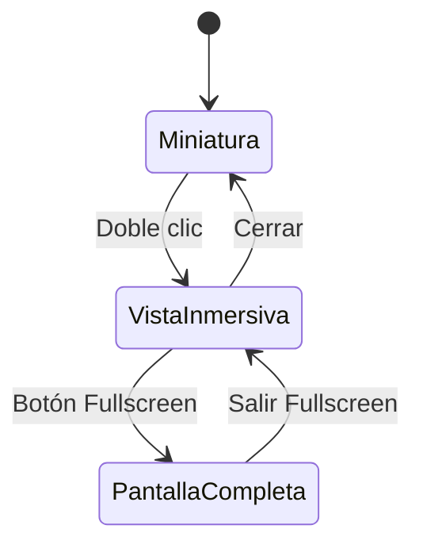

# PDFThumbnail Component

## 📋 Descripción

Componente premium de miniatura PDF con funcionalidad de **doble clic para visualización inmersiva a pantalla completa**. Diseñado específicamente para la plataforma Edutechlife con identidad visual corporativa.

## 🎯 Características Principales

### 1. **Miniatura Premium**
- Diseño visual premium con gradientes corporativos Edutechlife
- Iconografía personalizada con efectos hover
- Metadatos completos del documento (tamaño, páginas, formato)
- Indicador visual de interactividad

### 2. **Visualización Inmersiva**
- **Doble clic** para abrir vista a pantalla completa
- Visor PDF embebido con controles de navegación
- Botón de pantalla completa nativo del navegador
- Zoom y desplazamiento con rueda del mouse

### 3. **Controles de Usuario**
- Botón "Cerrar Visor" para regresar al dashboard
- Botón "Volver al Dashboard" en footer
- Botón de descarga directa del PDF
- Cierre con clic fuera del visor o tecla ESC

### 4. **Accesibilidad**
- Atributos ARIA completos
- Navegación por teclado
- Textos descriptivos para lectores de pantalla
- Contraste de colores WCAG AA

## 🚀 Uso Básico

```jsx
import PDFThumbnail from './PDFThumbnail';

function MyComponent() {
  return (
    <PDFThumbnail
      title="Guía: Anatomía de un Prompt"
      pdfUrl="/Doc/guia-anatomia-prompt.pdf"
      description="Documento PDF con estructura detallada de prompts efectivos"
      size="4.0 MB"
      pages={12}
    />
  );
}
```

## ⚙️ Props

| Prop | Tipo | Requerido | Default | Descripción |
|------|------|-----------|---------|-------------|
| `title` | string | ✅ | "Guía: Anatomía de un Prompt" | Título del documento |
| `pdfUrl` | string | ✅ | "/Doc/guia-anatomia-prompt.pdf" | URL del archivo PDF |
| `description` | string | ✅ | "Documento PDF con estructura..." | Descripción del contenido |
| `size` | string | ✅ | "2.4 MB" | Tamaño del archivo |
| `pages` | number | ✅ | 12 | Número de páginas |

## 🎨 Estilos Corporativos

### Colores Edutechlife
```css
/* Azul petróleo - Títulos y elementos principales */
--color-primary: #004B63;

/* Cyan - Botones y elementos interactivos */
--color-accent: #00BCD4;

/* Gradientes premium */
.gradient-primary {
  background: linear-gradient(135deg, #004B63, #006D8F);
}

.gradient-accent {
  background: linear-gradient(135deg, #00BCD4, #4DD0E1);
}
```

### Efectos Visuales
- **Hover**: `scale-[1.02]` con transición suave
- **Active**: `scale-[0.98]` para feedback táctil
- **Shadow**: Elevación progresiva en hover
- **Blur**: Efectos glassmorphism en overlays

## 🖱️ Interacción del Usuario

### Flujo Principal
1. **Usuario ve la miniatura** con indicador "Doble clic"
2. **Hace doble clic** en la miniatura
3. **Se abre vista inmersiva** con PDF a pantalla completa
4. **Puede:**
   - Navegar por páginas
   - Hacer zoom con rueda del mouse
   - Descargar el documento
   - Activar pantalla completa del navegador
5. **Cierra** con:
   - Botón "Cerrar Visor"
   - Botón "Volver al Dashboard"
   - Clic fuera del visor
   - Tecla ESC

### Estados del Componente


## 🔧 Integración con ResourceViewer

El componente se integra automáticamente con `ResourceViewer.jsx` cuando el tipo de recurso es `pdf-thumbnail`:

```javascript
// En moduleResources.js
{
  type: 'pdf-thumbnail',
  title: 'Guía: Anatomía de un Prompt',
  url: '/Doc/guia-anatomia-prompt.pdf',
  // ... más props
}
```

## 🧪 Testing

### Casos de Prueba Cubiertos
1. ✅ Renderizado correcto de información
2. ✅ Apertura de vista inmersiva con doble clic
3. ✅ Cierre con botón "Cerrar Visor"
4. ✅ Cierre con clic fuera del visor
5. ✅ Funcionalidad de descarga
6. ✅ Atributos de accesibilidad
7. ✅ Control de scroll del body

### Ejecutar Tests
```bash
npm test -- PDFThumbnail.test.jsx
```

## 📱 Responsive Design

El componente es completamente responsive:

- **Desktop (> 1024px)**: Visor max-w-6xl
- **Tablet (768px - 1024px)**: Visor con padding reducido
- **Mobile (< 768px)**: Visor a pantalla completa sin bordes

## ♿ Accesibilidad

### Nivel WCAG 2.1 AA
- **Contraste**: 4.5:1 mínimo en todos los textos
- **Focus**: Anillos focus visibles en todos los controles
- **ARIA**: Roles y labels apropiados
- **Keyboard**: Navegación completa por teclado
- **Screen Readers**: Textos alternativos descriptivos

### Atributos ARIA Implementados
```jsx
aria-label="Abrir {title} en vista inmersiva (doble clic)"
aria-label="Cerrar visor y volver al dashboard"
role="presentation" // Para overlay de fondo
```

## 🐛 Solución de Problemas

### Problemas Comunes

1. **PDF no se carga**
   - Verificar que la URL sea correcta
    - Asegurar que el archivo exista en `/public/`
   - Verificar permisos del servidor

2. **Doble clic no funciona**
   - Verificar que el evento `onDoubleClick` esté configurado
   - Revisar overlays que puedan estar bloqueando
   - Probar en diferentes navegadores

3. **Vista inmersiva no cierra**
   - Verificar función `handleCloseImmersiveView`
   - Revisar event listeners del overlay
   - Probar tecla ESC

### Debugging
```javascript
// Agregar logs para debugging
console.log('PDF URL:', pdfUrl);
console.log('Immersive view open:', isImmersiveViewOpen);
```

## 🔄 Mantenimiento

### Actualizaciones Recomendadas
1. **Optimización de rendimiento**: Lazy loading del iframe
2. **Nuevas características**: Marcadores, anotaciones
3. **Compatibilidad**: Soporte para más formatos de documento
4. **Analytics**: Tracking de uso del visor

### Dependencias
- React 18+
- Framer Motion para animaciones
- Iconos de `../../utils/iconMapping.jsx`
- Utility classes de Tailwind CSS

## 📄 Licencia

Componente desarrollado para Edutechlife Platform v2.0
© 2024 Edutechlife - Todos los derechos reservados